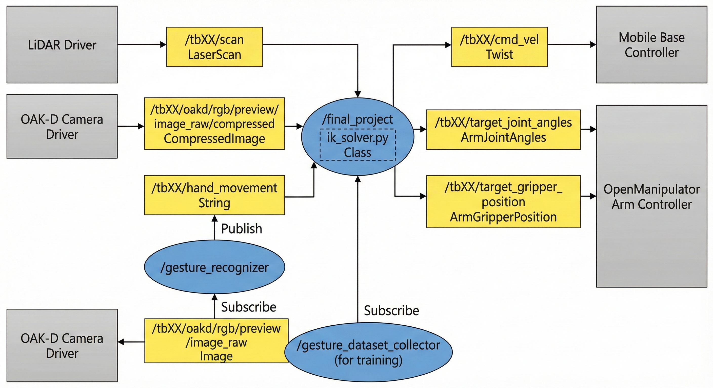

# Gesture-Controlled Mood-Based Robot

## Project Description

The goal of our project is to control a robot so that it performs different tasks expressing “moods” in response to a user’s hand gestures. This is not just a pure engineering project but an **Engineering + HRI (Human-Robot Interaction)** project that aligns with a broader trend in robotics: as robots become more capable, it becomes increasingly important for them to respond to humans with appropriate, legible emotional behavior.

We use **Computer Vision (CV)** and **Inverse Kinematics (IK)** as our main components. Using CV, we detect three hand gestures that map to three mood levels:

  * **Fist (Low Mood):** The robot picks up an entertaining object and presents it to the user.
  * **V Sign (High Mood):** The robot performs a “dance” sequence.
  * **Open Palm (Rest):** The robot navigates through obstacles to move to a designated rest position.

For the dancing and object-pickup behaviors, we use our IK solver to convert 3D target positions into joint angle configurations for the robot. Our IK solver has been tested under multiple conditions, including varying target heights and horizontal distances, and has been shown to produce reliable, executable motions. Together, these components form a pipeline where user gestures are interpreted as moods, which are then translated into expressive robot actions.

## System Architecture

Our system is organized as a **ROS2-based perception–decision–control pipeline** with three main components: a gesture recognition subsystem, a navigation and AR-tag targeting subsystem, and an arm control + IK subsystem. These components run as separate ROS nodes that communicate via topics.

### 1\. Gesture Recognition (`gesture.py`)

This node interprets the user’s hand gestures and publishes them as discrete commands.

  * **Tech Stack:** MediaPipe Hands, k-NN classifier.
  * **Training:** Using `gesture_training.py`, we collect a dataset of 3D hand landmark features for our three gestures (fist, V sign, open palm), saving them into `gesture_dataset.npz`.
  * **Runtime:** The node subscribes to the RGB camera stream, detects landmarks, converts them into normalized 63-D feature vectors, and classifies them against the dataset.
  * **Output:** Publishes the label (`"0"`, `"2"`, or `"5"`) on the `/tbXX/hand_movement` topic.

### 2\. Central Controller (`final_project.py`)

This node integrates LiDAR, camera, and gesture inputs to control the base and arm.

  * **Logic:**
      * **Debouncing:** A gesture must be stable for 3 seconds in `gesture_callback` to be accepted.
      * **Mappings:**
          * `"0"`: Rest behavior (Tag 3).
          * `"2"`: Dance behavior (Tag 1).
          * `"5"`: Pick up object and return (Tags 2 and 1).
      * **Navigation:** Handled by a state machine in `_do_obstacle_avoidance`. Uses LiDAR to follow a square search pattern or execute rectangular detours.
      * **Visual Servoing:** When an AR tag is visible, it runs a proportional controller on pixel error and uses image area as a stopping condition.

### 3\. Arm Control & IK (`ik_solver.py`)

Provides an inverse kinematics solver for the OpenMANIPULATOR arm.

  * **Implementation:** The `OpenManipulatorIK` class implements forward and inverse kinematics using calibrated link parameters, an analytical seed, and an **L-BFGS-B optimizer**. It enforces joint limits and reachability checks.
  * **Integration:** `final_project.py` uses the `IK(x, y, z)` helper wrapper inside tasks like `arm_resting`, `arm_dancing`, and `arm_grabbing` to convert high-level goals into `ArmJointAngles` and `ArmGripperPosition` commands.

## ROS Node Diagram

## Execution
  * **[Terminal #1]** SSH into the robot (password: turtlebot4), check USB port number, and run bringup:

`$ set_robot_num [robot_num]

$ ssh ubuntu@$ROBOT_IP

$ sudo dmesg | grep ttyUSB`

After running sudo dmesg | grep ttyUSB look for which USB port the FTDI USB Serial Device is connected to, it should be either ttyUSB0 or ttyUSB1. Now run the bringup command for the arm by specifying the USB port you identified in the prior step.

`$ bringup_arm port_name:=/dev/ttyUSB1`

 * **[Terminal #2]** SSH into the robot and start MoveIt!: In a separate second terminal, ssh into the robot and start MoveIt!.

`$ ssh ubuntu@$ROBOT_IP

$ start_moveit`

 * **[Terminal #3]** Run the OpenManipulator c++ interface on the PC.

`ros2 run omx_cpp_interface arm_cmd`

 * **[Terminal #4]** Run the gesture node, which will send the continuous detected gesture signals to your Turtlebot.

`ros2 run intro_to_robotics_final_project gesture`

 * **[Terminal #5]** Run the main node.

`ros2 run intro_to_robotics_final_project final-project`

## Challenges

### Computer Vision (CV)

  * **Landmark Sensitivity:** Landmark coordinates were very sensitive to hand position and size in the frame.
      * *Solution:* We normalized all landmarks relative to the wrist and scale, then collected consistent robot-camera training data.
  * **Obstacle Avoidance:** If the front path was blocked, turning randomly often led into other objects.
      * *Solution:* We computed separate minimum distances for left and right LiDAR sectors and always chose the side with more free space.

### Inverse Kinematics (IK)

  * **Reachable Space:** The arm’s reachable space did not overlap well with the camera’s detectable space.
      * *Solution:* We used smaller AR tags and placed tags on blocks instead of directly on the object to be grasped.
  * **Infinite Solutions:** For a 4-DOF arm with a 3D position, if pitch is not specified, solutions are inconsistent.
      * *Solution:* We implemented a set of pitches for the IK solver to guess, starting with 0.0.

## Future Work

### Computer Vision

  * **Smarter Search:** Replace the hard-coded square search with a dynamic strategy (e.g., frontier-style or spiral patterns) that reacts to obstacles and visited areas.
  * **Local Map:** Build a simple occupancy grid from LiDAR instead of using three distance sectors to enable smoother path planning around clutter.

### Inverse Kinematics

  * **Y-Position Integration:** Add the y-position (horizontal position of objects) into consideration to enable grasping in more diverse conditions.

## Takeaways

### Computer Vision

  * Learned the pipeline from **Raw RGB images → Hand landmarks → Normalized feature vectors**, and the importance of feature normalization for robustness.
  * Validated that a simple **k-NN classifier** is effective given a clean dataset and well-designed features (MediaPipe).
  * Experienced the distinction between offline dataset collection (`gesture_training.py`) and real-time inference (`gesture.py`), and the value of UI feedback for debugging.

### Inverse Kinematics

  * Implemented a **4-DOF IK solver** combining analytical insight (initial guesses) with numerical optimization (L-BFGS-B), demonstrating the value of hybrid approaches.
  * Calibrated link lengths and offsets to match the OpenMANIPULATOR, highlighting the sensitivity of IK to accurate parameters.
  * Utilized reachability checks and error logging to prevent impossible poses and streamline debugging.
